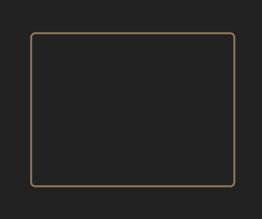
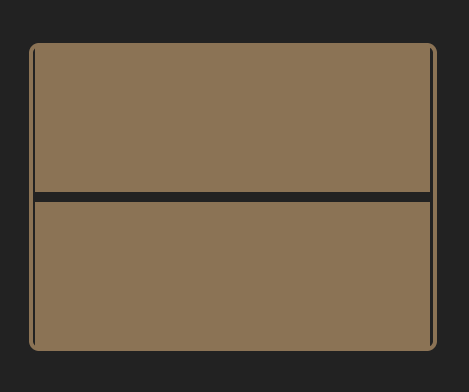
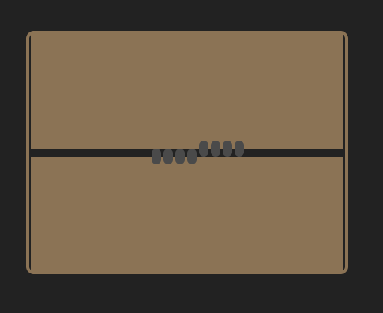

# Monster in a Box - CSS Animation Project


Welcome to your first **build-from-scratch** animation project! Today you're going to bring something strange to life - a mysterious creature peering through a crack in a box.

This isn't just about animations though. You'll be practicing the complete web development workflow: planning your structure, writing HTML from scratch, styling with CSS, and then adding the magic of animation.

## 🎯 What You'll Build

By the end of this project, you'll have created:

- **A contained scene**: A bordered box that holds your animation
- **Dynamic walls**: Pieces that slide apart to reveal a crack
- **Monster fingers**: Dark appendages gripping the crack edges
- **Mysterious eyes**: Glowing orbs that blink when the crack opens
- **Coordinated animation**: Everything moving together in sequence

## 🚀 Your Mission

> **The Challenge**: Build an animated scene where a mysterious creature is trapped in a box, occasionally prying the walls apart with its fingers to peek out with glowing eyes.

You'll approach this like a real developer would - breaking down the problem, building piece by piece, and testing as you go.

## 📋 The Development Process

Each checkpoint below represents a working milestone. Don't rush ahead - make sure each step works before moving to the next!

### Checkpoint 0: Project Setup

**Goal**: Create your project files from scratch

**Your challenge**: Set up the basic HTML and CSS files that will contain your monster animation.

**Think about**:

- What files do you need for a web project with HTML and CSS?
- What goes in the basic structure of an HTML file?
- How do you link a CSS file to your HTML?

**Key considerations**:

- Create an `index.html` file with proper HTML5 structure
- Create a `style.css` file for your styling
- Link them together using the `<link>` tag
- Set up basic body styling for a centered dark page

<details>
<summary>💡 Getting Started Hints</summary>

Your HTML should include:

```html
<!DOCTYPE html>
<html lang="en">
  <head>
    <meta charset="UTF-8" />
    <meta name="viewport" content="width=device-width, initial-scale=1.0" />
    <title>Monster in a Box</title>
    <!-- Don't forget to link your CSS file -->
  </head>
  <body>
    <!-- Your monster elements will go here -->
  </body>
</html>
```

Your CSS should start with page setup:

```css
body {
  margin: 0;
  padding: 20px;
  background: #222;
  display: flex;
  justify-content: center;
  align-items: center;
  min-height: 100vh;
  font-family: Arial, sans-serif;
}
```

</details>

### Checkpoint 1: Scene Setup

**Goal**: Create the foundation structure

**Your challenge**: Create a box that will contain your monster scene.

**Think about**:

- What HTML element will serve as your main container?
- How can you center something on the page using CSS?
- What CSS properties create borders and rounded corners?

**Key considerations**:

- The box should be positioned so other elements can be placed inside it
- Choose a brown color (#8B7355) that matches the "wall" theme
- Make it large enough to hold your scene (around 400x300px works well)

<details>
<summary>🖼️ Checkpoint 1 Reference</summary>



Your page should show a simple bordered box centered on a dark background.

</details>

### Checkpoint 2: Wall Structure

**Goal**: Fill the box with walls that have a crack

**Your challenge**: Create two wall pieces that fill most of the box but leave a gap between them.

**Think about**:

- How can you create a horizontal crack across the middle?
- What's the best way to position two pieces with a gap between them?
- How should the wall color relate to your box border?

**Key considerations**:

- Consider making one wall piece for the top half, one for the bottom half
- Leave a small gap between them (this will be your crack)
- The walls should nearly fill the container width but leave the crack visible
- Match the wall background color to your border color

<details>
<summary>🖼️ Checkpoint 2 Reference</summary>



Your box should now be filled with brown walls, with a thin dark crack visible across the middle.

</details>

### Checkpoint 3: Monster Fingers

**Goal**: Add fingers gripping the crack edges

**Your challenge**: Create multiple small elements that look like fingers holding onto the crack edges.

**Think about**:

- How many fingers would make it look realistic but not overcrowded?
- What shape and color would make them look like monster fingers?
- How can you position them at different spots along the crack?

**Key considerations**:

- Fingers should appear to be gripping both the top and bottom crack edges
- Make them small dark rectangles with rounded corners for a finger-like appearance
- Position them at slightly different spots to look more natural
- Consider 3-4 fingers per edge as a good balance

<details>
<summary>🖼️ Checkpoint 3 Reference</summary>



Dark finger-like shapes should now be visible gripping both edges of the crack.

</details>

### Checkpoint 4: Monster Eyes

**Goal**: Add hidden eyes behind the crack

**Your challenge**: Create eyes that will eventually peek through when the crack opens, but keep them hidden for now.

**Think about**:

- What makes something look like an eye in web design?
- How can you position elements in the crack area?
- How do you hide elements without removing them entirely?

**Key considerations**:

- Create circular elements for the eye shape
- Add smaller dark circles inside for pupils (hint: pseudo-elements work well)
- Position them where they'd be visible through the crack
- Set opacity to 0 to hide them initially
- Choose a color that stands out but looks monster-like

<details>
<summary>🖼️ Checkpoint 4 Reference</summary>


The scene should look the same as Checkpoint 3 - the eyes are there but hidden.

</details>

### Checkpoint 5: Wall Opening Animation

**Goal**: Make the walls slide apart

**Your challenge**: Animate the walls to periodically separate, creating a wider crack.

**Think about**:

- What CSS properties can move elements around?
- How do you create animations that repeat?
- What timing would make the animation feel suspenseful?

**Key considerations**:

- Use `@keyframes` to define the animation sequence
- Consider using `transform` properties for smooth movement
- The walls should move in opposite directions (one up, one down)
- Add some timing delay - closed most of the time, open briefly
- A 12-second cycle works well for suspense

<details>
<summary>🖼️ Checkpoint 5 Reference</summary>


The walls should now slide apart periodically, revealing a wider crack.

</details>

### Checkpoint 6: Finger Extension

**Goal**: Make fingers extend as the crack opens

**Your challenge**: Coordinate finger animations with the wall opening so fingers stretch when the crack widens.

**Think about**:

- How can you make elements appear to grow longer?
- How do you coordinate multiple animations to happen at the same time?
- Should top and bottom fingers behave differently?

**Key considerations**:

- Fingers should extend away from the center of the crack
- Match the timing with your wall animation
- Top fingers might extend upward, bottom fingers downward, like the hand is gripping the edges of the box.
- Use the same duration as your wall animation for coordination

<details>
<summary>🖼️ Checkpoint 6 Reference</summary>


As the crack opens, the fingers should stretch to reach further into the gap.

</details>

### Checkpoint 7: Eye Blinking Animation

**Goal**: Complete the creature with blinking eyes

**Your challenge**: Make the eyes appear and blink when the crack is fully open, creating a full "monster peeking out" effect.

**Think about**:

- When should the eyes be visible during the crack cycle?
- How can you create a blinking effect?
- How do you coordinate this with the other animations?

**Key considerations**:

- Eyes should only appear when the crack is wide open
- Create a blinking effect by animating both opacity and height
- Multiple blinks create a more lifelike effect
- Keep the same 12-second timing to stay synchronized

<details>
<summary>🖼️ Checkpoint 7 Reference</summary>


Your complete monster should now peek through the crack with animated blinking eyes!

</details>

## 🛠️ Getting Started

1. **Start with Checkpoint 0**: Create your project files from scratch
2. **Work through each checkpoint**: Don't skip ahead!
3. **Test frequently**: Open your HTML file in the browser after each change
4. **Reference the examples**: Use the checkpoint images to verify you're on track

## 📝 Development Tips

### HTML Structure Strategy

Think about what elements you need:

- A container for the whole scene
- Wall pieces that can move
- Individual finger elements you can position
- Eye elements you can show/hide

### CSS Positioning Approach

- Use `position: relative` on containers
- Use `position: absolute` for elements you need to place precisely
- Remember that transforms are great for animations

### Animation Timing

- Start with simple movements, add complexity later
- Use the same duration for related animations to keep them synchronized
- Test one animation at a time before combining them

## 🔧 Getting Unstuck

### If elements aren't positioning correctly:

- Double-check your position properties (`relative` vs `absolute`)
- Verify your container has `position: relative`
- Use browser developer tools to inspect element positions

### If animations aren't working:

- Make sure your `@keyframes` name matches your `animation` property
- Check that you have semicolons after all CSS properties
- Verify your timing values make sense

### If you're completely stuck:

- Try building just one piece at a time
- Compare your approach with the checkpoint reference files
- As a last resort, check `solution.html` (but try to solve it yourself first!)
- Remember: every developer gets stuck - persistence is the key skill

## 🎨 Make It Your Own

Once you have the basic animation working, feel free to experiment:

- Change colors (monster eyes, wall color, finger color)
- Adjust timing (faster/slower animations)
- Modify positions (different finger arrangements)
- Add your own creative touches!

## 🎉 Success Criteria

You'll know you've succeeded when:

- Your box appears centered with proper styling
- Walls slide apart smoothly in a coordinated way
- Fingers extend and retract with the wall movement
- Eyes appear and blink when the crack is open
- The whole sequence loops smoothly
- You built it yourself from scratch!

---

**Estimated Time**: 90 minutes  
**Difficulty**: Intermediate (build-from-scratch challenge)  
**Skills Focus**: HTML structure, CSS positioning, keyframe animations, project workflow

Ready to bring your monster to life? Let's start with Checkpoint 0!
