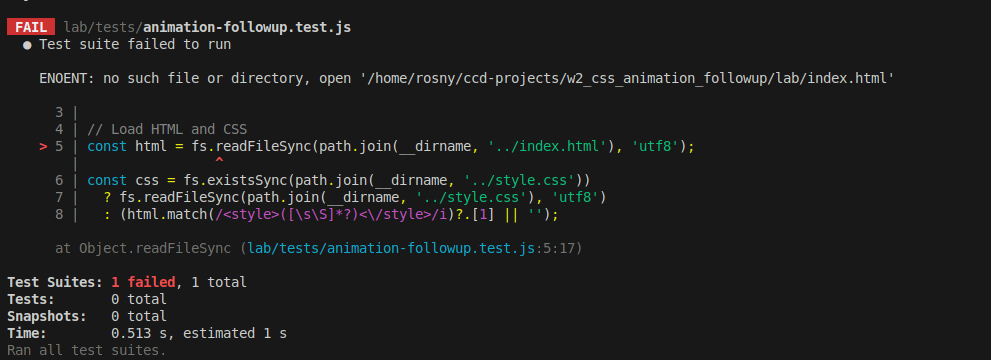

# CSS Animation Follow-up: Monster in a Box


## Project Overview

This is a hands-on CSS animation project where students build a mysterious creature animation from scratch. The project focuses on creating a "Monster in a Box" scene where a creature trapped inside occasionally pries open the walls to peek out with glowing eyes.

## Learning Objectives

Students will practice:

- **HTML Structure**: Building semantic markup from scratch
- **CSS Positioning**: Using relative and absolute positioning effectively  
- **CSS Animations**: Creating coordinated keyframe animations
- **Project Workflow**: Planning, building incrementally, and testing progressively
- **Problem Solving**: Breaking down complex animations into manageable pieces

## Project Structure

```
├── README.md                   # This overview file
├── assets/                     # Reference images and demo GIF
│   ├── monster_in_a_box.gif   # Final animation demo
│   └── *.png                   # Checkpoint reference images
└── lab/                        # Student workspace and instructions
    ├── README.md               # Detailed lab instructions
    └── checkpoints/            # Reference solutions for each step
        ├── checkpoint-1-scene-setup.html
        ├── checkpoint-2-wall-structure.html
        ├── checkpoint-3-monster-fingers.html
        ├── checkpoint-4-monster-eyes.html
        └── solution.html       # Complete solution
```

## What Students Will Build

The final animation includes:

- **Centered Scene**: A bordered container that frames the animation
- **Opening Walls**: Two wall sections that slide apart to create a crack
- **Monster Fingers**: Dark appendages that grip the crack edges and extend as it opens
- **Blinking Eyes**: Mysterious glowing orbs that appear and blink when the crack widens
- **Coordinated Movement**: All elements animated together in a smooth 12-second loop

## Teaching Approach

This is a **build-from-scratch** project designed to reinforce:

1. **Progressive Development**: Students work through 7 checkpoints, building one feature at a time
2. **Independent Problem Solving**: Minimal starter code forces students to think through structure
3. **Real Development Workflow**: Planning → Building → Testing → Refining
4. **Animation Coordination**: Learning to synchronize multiple animated elements

## Difficulty Level

- **Level**: Intermediate
- **Estimated Time**: 90 minutes
- **Prerequisites**: Basic HTML, CSS positioning, and CSS animations knowledge
- **Skills Focus**: Project planning, CSS keyframes, element coordination

## Getting Started

Students should navigate to the `lab/` directory and follow the detailed instructions in the lab README. Each checkpoint builds upon the previous one, with reference images provided to verify progress.

## Getting Unstuck

If you’re stuck or tests are failing, follow these steps to troubleshoot and complete the "Monster in a Box" project:

### Run the Tests

Run the test suite to check your progress:

```bash
npm test
```

> This command runs `lab/tests/animation-followup.test.js` to validate your **index.html** and **CSS** . Review the output for errors, such as:

```bash
textExpected pattern: /background:\s*#222/i
Received string: ""
```

### Common Error Example

 👇


> This means the `index.html` file is not found, likely because `lab/index.html` is missing.
> This kind of error occurs also when the test cannot find **CSS** rules `(e.g., body { background: #222; })`. It’s caused by a missing `lab/style.css`.

**Fix**:

- Create `lab/index.html`
- create `lab/style.css`
- Link the `style.css` file in index.html:

```html
    <link rel="stylesheet" href="./style.css">
```

## Getting Help?

If you’re unsure about the expected implementation, view the solution:

```bash
    git checkout solution
```

> Check **lab/checkpoints/solution.html** for the complete code. Compare it with your work, but return to your branch `(git checkout your-work-branch)` to continue building your solution

---

*Part of the Onja CSS Animation curriculum - Week 2 Follow-up Project*
